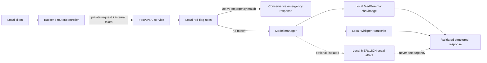

# MediSync AI: local inference service (Syncia)

Syncia is the patient-facing name of the MediSync AI assistant. This service powers it by running
MedGemma, Whisper Small, and optional MERaLiON locally. It
does not download models or call hosted inference services at runtime. Models
load only from `AI/weights` (or an explicitly configured local weights path).
All red-flag rules and prompt templates are local files.

> **Prototype, not a medical device.** Outputs are preliminary decision
> support, not diagnoses or treatment instructions. Red-flag translations and
> matching rules are drafts requiring review by qualified Filipino and English
> clinicians before any patient use. They have not been clinically validated.

## Architecture



`app/main.py` validates and routes requests; `app/model_manager.py` loads model
instances once per process and serializes inference per device. A single Uvicorn
worker is required to avoid duplicate model memory. Startup loading occurs in a
worker thread; lazy loading also runs outside the event loop. Inference runs in
the thread pool. Queue waits have a configurable timeout; model generation
does not yet have a hard deadline.

## Setup

Use Python 3.11. Install a PyTorch build appropriate for the client's CPU/CUDA
configuration first, then install the remaining dependencies:

```powershell
py -3.11 -m venv .venv
.\.venv\Scripts\Activate.ps1
python -m pip install --upgrade pip
# Install the appropriate local PyTorch CPU/CUDA build first.
python -m pip install -r requirements.txt
Copy-Item .env.example .env
```

Model acquisition is a separate, deliberate setup step. The runtime is forced
into Hugging Face offline mode and uses `local_files_only=True`; it will fail
clearly if required local files are absent. Place model files in:

| Model | Default folder | Runtime status |
| --- | --- | --- |
| MedGemma 4B IT | `weights/medgemma-4b-it` | Required for chat and image analysis. The repository contains no weights. |
| Whisper Small | `weights/whisper-small` | Required for transcription. The repository contains no weights. |
| MERaLiON-SER-v1 | `weights/meralion-ser-v1` | Optional; disabled by default and never connected to urgency. |

Obtain model approvals and review each model's license/terms before downloading
or distributing weights. MERaLiON uses local `trust_remote_code=True`; its
Python implementation is executable code and must be reviewed and trusted.
Dependencies and model licenses are separate: check the upstream license for
each package and checkpoint when distributing a client installation.

Defaults target a CUDA GPU with about 6 GB VRAM using 4-bit MedGemma
quantization; this is not a guarantee that all requests fit. CPU fallback loads
MedGemma unquantized and may be very slow or exceed available RAM. For client
machines, validate RAM/VRAM and latency with the real weights before enabling
the service. Whisper uses FP16 on CUDA and FP32 on CPU. MERaLiON defaults to
CPU and off.

Set a long random `AI_INTERNAL_TOKEN` in `AI/.env` and the exact same value in
the backend environment. Do not use the example placeholder in a deployed
installation. Run from this directory:

```powershell
python -m app.main
```

The service binds to `127.0.0.1:8001` by default. Keep it on loopback when the
Backend runs on the same host. For separate local containers, restrict binding
and network access to a private interface. Never expose the AI service or its
internal token to the public internet.

## Offline operation and privacy

Hugging Face hub/Transformers offline mode and telemetry disabling are forced
before model imports. Model loading uses local paths only. The AI application
does not intentionally persist uploads; FastAPI/Starlette may temporarily spool
multipart bodies to local temporary storage while parsing. Restrict that
storage on machines handling patient data and define an operational cleanup
policy.

Service logging is intended to contain request IDs, model status, timings,
error types/codes, and rule IDs—not patient text, audio, or image contents. The
manual smoke test reports metadata only. Avoid enabling HTTP/body debug logging
in the Backend or deployment proxy. No encrypted audit-storage implementation
is included; add one only after an approved local key-management and retention
design.

## Endpoints

All routes except liveness require `X-Internal-Token`.

| Method and path | Input | Purpose |
| --- | --- | --- |
| `GET /internal/health` | None | Unauthenticated liveness only; does not promise models are ready. |
| `GET /internal/ready` | Internal token | `200` when at least one enabled model is ready and all enabled models are ready; otherwise `503`. |
| `GET /internal/models/status` | Internal token | Enabled/state/device and hardware status. |
| `POST /internal/medical/chat` | JSON `ChatRequest` | Structured preliminary symptom guidance. |
| `POST /internal/medical/analyze-image` | Multipart `image`, optional JSON `context` | Structured visible observations and limitations. |
| `POST /internal/audio/transcribe` | Multipart `audio`, optional `language` (`auto`, `en`, `fil`) | Transcript, detected language and warnings. Transcripts should be shown for patient confirmation before relying on them. |
| `POST /internal/audio/analyze` | Multipart `audio` | Experimental vocal-affect estimate only; disabled by default. |

Expected input/output shapes and validation limits are in `app/schemas.py`.
Errors use `{"error":{"code":"...","message":"...","request_id":"..."}}`.
Typical errors are `401` for missing/invalid internal token, `422` for invalid
input, and `503` for disabled/not-ready/busy/OOM models. Unexpected errors
return a generic `500` without a traceback or raw request content.

### Adding a red-flag rule

1. Edit `app/resources/red-flags.json`; give the rule a stable snake-case ID,
   English/Filipino labels, and narrow English/Filipino regex patterns.
2. Add positive, negated, historical, and mixed-language cases in
   `tests/test_safety.py`.
3. Ask qualified clinicians to review the rule, translations, emergency
   guidance, and false-positive/false-negative cases before patient use.
4. Never use MERaLiON emotion labels as red flags or urgency signals. Rule IDs
   are metadata; matched patient phrases are not logged.

The matcher ignores clearly negated and historical mentions when recognizable.
Natural-language negation, context, code-switching, and symptom phrasing are
not reliably solved by regular expressions; this layer is not a substitute for
clinical validation.

## Tests and local smoke tests

Run the model-free suite from `AI/`:

```powershell
python -m pytest tests -q
```

The tests use stubs and synthetic media and need no downloaded weights or GPU.
Real-model checks are separate:

```powershell
python -m scripts.smoke_test whisper
python -m scripts.smoke_test medgemma
python -m scripts.smoke_test medgemma-image
```

The synthetic evaluation scaffolding under `eval/` is not clinical evidence.
See [eval/README.md](eval/README.md) for the local triage and speech-WER
commands. Have clinicians author and approve a representative,
de-identified English/Filipino/Taglish set before interpreting triage
accuracy. Under-triage is reported as the headline safety metric.

## Known limitations

- Red-flag patterns and Filipino wording need clinician review and measured
  sensitivity/specificity; they can miss uncommon wording and context.
- Whisper may misrecognize Taglish and medical terms. Audio preprocessing trims
  quiet leading/trailing frames and applies capped normalization; there is no
  voice activity model.
- Image analysis cannot confirm a diagnosis and may miss serious findings.
- Invalid structured model output is retried once, then returned as a
  conservative urgent fallback. This is not a clinically validated fallback.
- Models are resident until process shutdown; there is no unload/eviction or
  generation deadline.
- MERaLiON was not trained on Filipino/Tagalog and is experimental. Its output
  is supplementary only and must never determine pain, urgency, or routing.
- No clinical trial, regulatory review, security certification, or local
  encrypted audit-storage layer is provided.
